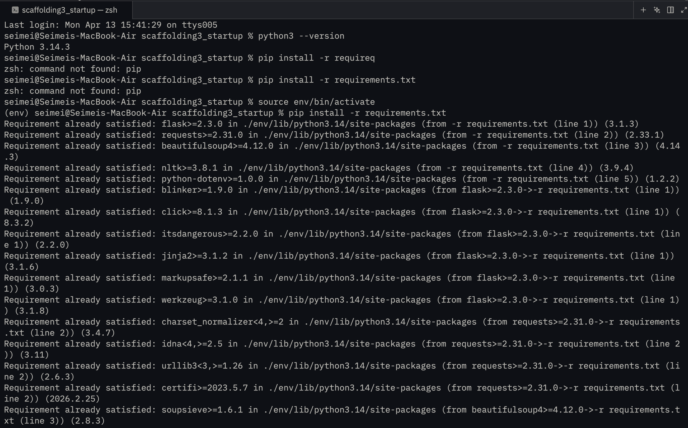
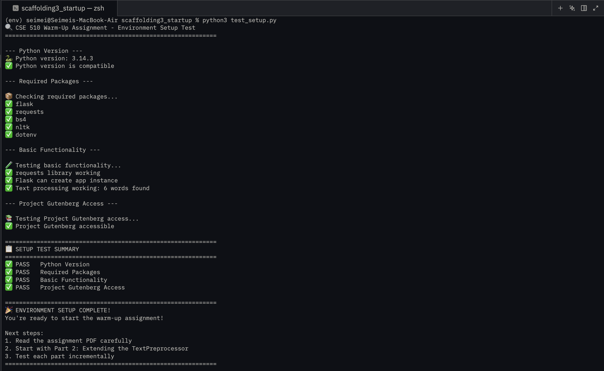

# CSE 510 Warm-Up Assignment: Text Preprocessing Web Service
Welcome to the warm-up assignment for CSE 510! This assignment will help you get familiar with text preprocessing, web development with Flask, and working with Project Gutenberg texts before diving into the main Shannon Information Theory assignment.

## 🎯 Assignment Overview
You'll build a web service that:
- Fetches text from Project Gutenberg URLs
- Cleans and preprocesses the text
- Provides statistical analysis
- Returns results via a clean web interface
- 
## 🚀 Quick Start
### 1. Fork & Open in GitHub Codespaces
1. Fork the starter repository: [https://github.com/delveccj/scaffolding3\_startup.git\](https://github.com/delveccj/scaffolding3\_startup.git)
2. Open your forked repository on GitHub
3. Click **Code → Codespaces → Create codespace on main**
### 2. Environment Setup
Once inside your Codespace, verify your environment:
```bash
python --version  # Should be 3.9+
pip install -r requirements.txt
python test_setup.py
```
If all tests pass, you're ready to go!

### 3. Run the Application
Start the Flask development server:
```bash
python app.py
```
Open your browser to: [http://localhost:5001\](http://localhost:5001)
> **Note:** Port 5001 is used instead of the default 5000 because macOS was already occupying port 5000.
### 4. Test the Interface
The web interface includes example URLs you can click to test:
- Pride and Prejudice by Jane Austen
- Frankenstein by Mary Shelley
- Alice in Wonderland by Lewis Carroll
- Moby Dick by Herman Melville
---
## 📝 What I Implemented
### Part 1: Environment Setup
- Forked the starter repo and created a GitHub Codespace
- Ran `test_setup.py` and verified all tests pass
- Confirmed access to Project Gutenberg URLs
- this is my requirement and test_setup passing screenshots


---
### Part 2: TextPreprocessor Methods
Implemented these methods in `starter_preprocess.py`:
#### `fetch_from_url(url: str) -> str`
- Downloads text content from a Project Gutenberg URL
- Validates that the URL ends with `.txt`
- Handles network errors appropriately
- Returns the raw text content
#### `get_text_statistics(text: str) -> Dict`
- Returns a dictionary with:
- `total_characters`: Total character count
- `total_words`: Total word count
- `total_sentences`: Total sentence count
- `avg_word_length`: Average word length
- `avg_sentence_length`: Average sentence length (words per sentence)
- `most_common_words`: List of top 10 most common words
#### `create_summary(text: str, num_sentences: int = 3) -> str`
- Extracts the first N sentences from the cleaned text
- Returns as a single string
**Deliverable:** Updated `starter_preprocess.py` with all three methods implemented
---
### Part 3: Flask API Endpoints
Implemented these endpoints in `app.py`:
#### `POST /api/clean`
Expected input:
```json
{"url": "https://www.gutenberg.org/files/1342/1342-0.txt"}
```
Expected output:
```json
{
"success": true,
"cleaned_text": "It is a truth universally acknowledged...",
"statistics": {
"total_characters": 717571,
"total_words": 124588,
"total_sentences": 6403,
"avg_word_length": 4.3,
"avg_sentence_length": 19.5,
"most_common_words": ["the", "to", "of", "and", "a", "..."]
},
"summary": "It is a truth universally acknowledged..."
}
```
#### `POST /api/analyze`
Expected input:
```json
{"text": "Your raw text here..."}
```
Expected output:
```json
{
"success": true,
"statistics": {...}
}
```
**Deliverable:** Working Flask application with all endpoints implemented
---
### Part 4: Create Simple Web Interface
Implemented the HTML and JavaScript in `templates/index.html`:
- Accepts a Project Gutenberg URL
- Handles form submission
- Makes API calls to `/api/clean`
- Shows a loading message while processing
- Displays the statistics in a readable format
- Shows the first 500 characters of cleaned text
- Displays the 3-sentence summary
- Handles errors gracefully
- Updated background styling to dark mode
**Deliverable:** Complete `index.html` with working interface
---
## 🧪 Testing
### Manual Testing
1. Start the server: `python app.py`
2. Open [http://localhost:5001\](http://localhost:5001)
3. Try the example URLs
4. Verify statistics make sense
### Code Testing
```bash
# Test individual components
python starter_preprocess.py
# Test specific methods
python -c "
from starter_preprocess import TextPreprocessor
tp = TextPreprocessor()
# Test your implementations here
"
```
---
## 📁 Project Structure
```
warmup-starter-repo/
├── README.md                    # This file
├── requirements.txt             # Python dependencies
├── test_setup.py                # Environment validation
├── app.py                       # Flask application with all endpoints
├── starter_preprocess.py        # Text processing with all methods
└── templates/
└── index.html               # Web interface
```
---
## 🌐 Example URLs to Test
BookURLPride and Prejudicehttps://www.gutenberg.org/files/1342/1342-0.txt
Frankensteinhttps://www.gutenberg.org/files/84/84-0.txt
Alice in Wonderlandhttps://www.gutenberg.org/files/11/11-0.txt
Moby Dickhttps://www.gutenberg.org/files/2701/2701-0.txt
---
## 📬 Submission Instructions
1. Complete all work in your **forked GitHub repository**
2. Add **screenshots** of your working application to this `README.md`
3. Submit a **plain text file (`.txt`)** to UBLearns containing only your repository URL
4. **Due: Tuesday, April 14, 2026 at 11:59 PM**
---
## 🆘 Common Issues
**"Module not found" errors**: Run `pip install -r requirements.txt`
**Network timeouts**: Project Gutenberg can be slow; add reasonable timeouts to your requests
**Text encoding issues**: Project Gutenberg uses UTF-8; specify encoding when needed
**Port already in use**: This project runs on port 5001 to avoid conflicts with macOS, which uses port 5000 by default. If 5001 is also taken, change the port in `app.py`
---
## 📚 Resources
- [Flask Documentation](https://flask.palletsprojects.com/)
- [Requests Library](https://requests.readthedocs.io/)
- [Project Gutenberg](https://www.gutenberg.org/)
- [Regular Expressions in Python](https://docs.python.org/3/library/re.html)
